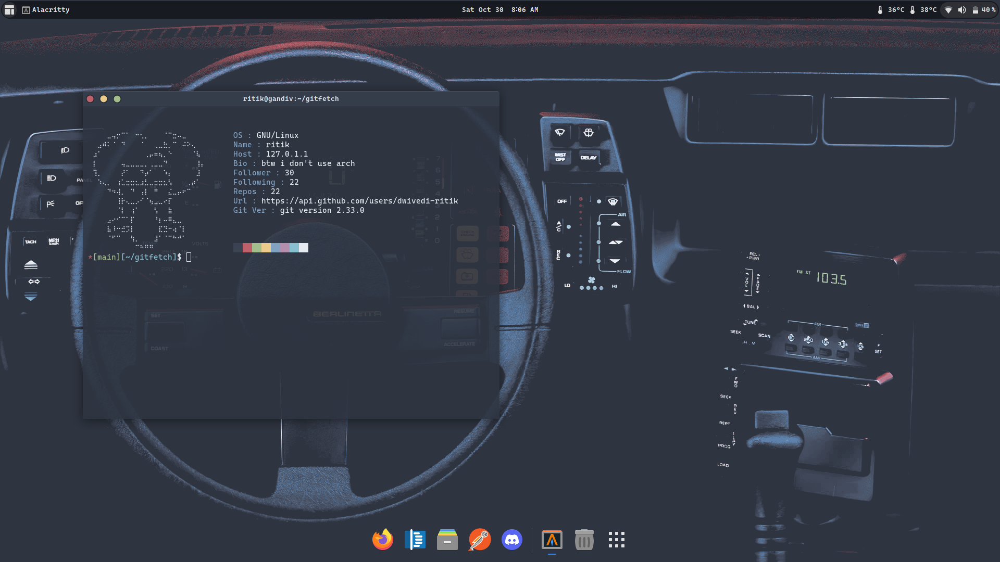

### Gitfetch

a shell script for git-fetch
<p>
    
</p>
Try 

```shell
$ gitfetch your_usrname
```

### Install

```shell
$ git clone https://github.com/dwivedi-ritik/gitfetch.git
```
then run `./install.sh`

### Remove

```shell
gitfetch -rm
```