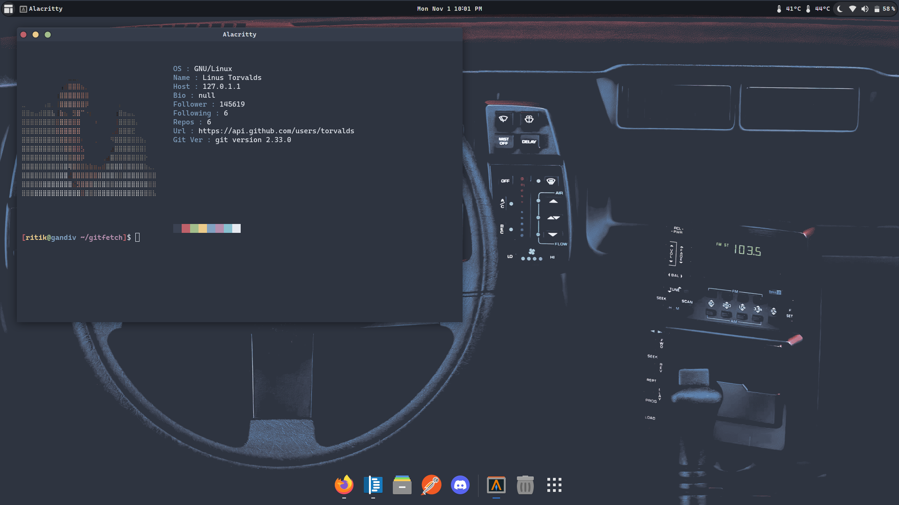

### Gitfetch

A fetch tool which fetch your gitprofile.

Try 

```shell
$ gitfetch your_usrname
```

```shell
$ gitfetch torvalds
```
<p>
    
</p>

### Dependency

- You must have [ascii-image-converter](https://github.com/TheZoraiz/ascii-image-converter)


### Install

```shell
$ git clone https://github.com/dwivedi-ritik/gitfetch.git
```
then run `./install.sh`

### Remove

```shell
gitfetch -rm
```